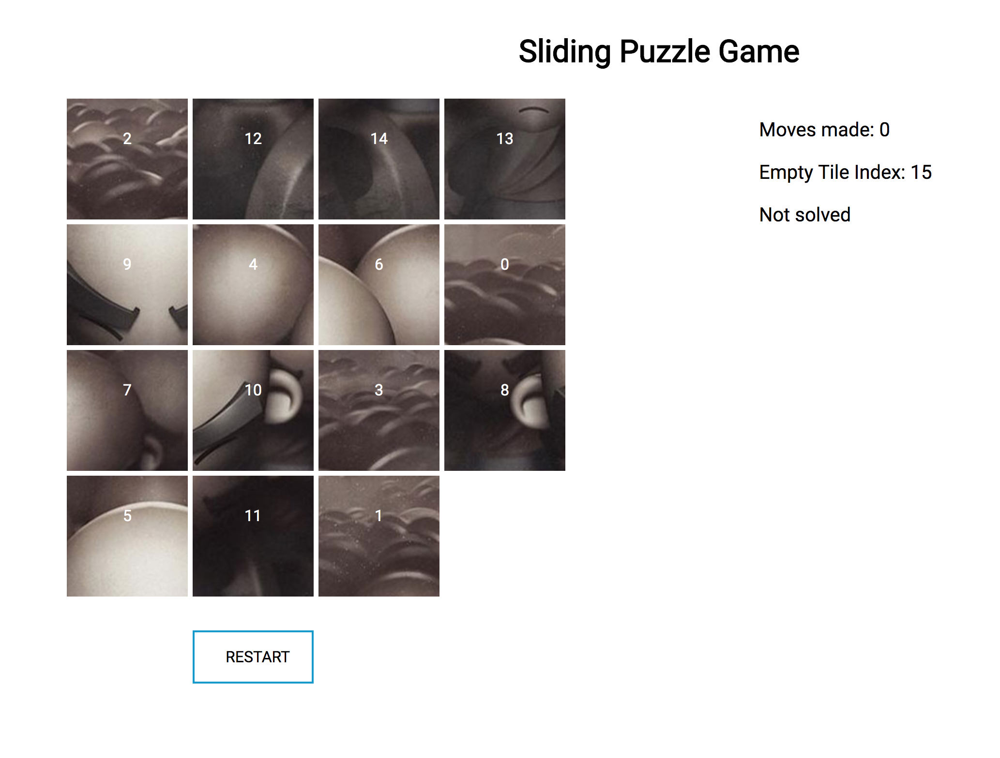

# Sliding puzzle game
This is a React Application that allows users to play the popular sliding puzzle game. A picture is given to the user and he/she has to rearrange the pieces to form the original picture




# Technology stack
1. ReactJS
2. Redux
3. Reselect
4. Jest
5. Sass

# Steps to install

- Clone this repository
```
git clone https://github.com/rotimi-babalola/sliding-puzzle-game.git
```
- Install dependencies
```
npm install
```
- Start the application in development mode

```
npm run start:dev
```

- Run production build
```
npm run prod
```

Have fun!
